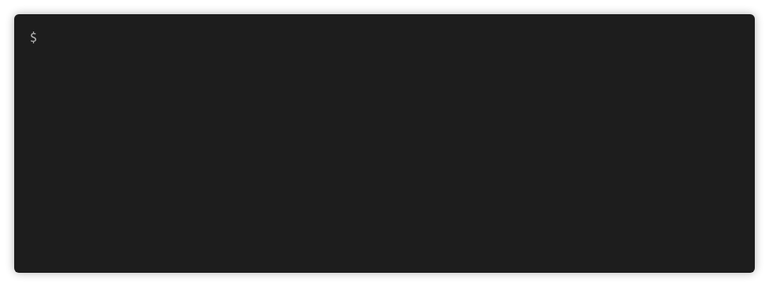

# Rust Warrior

[![Build Status][travis-badge]][travis]
[![Crates.io][crates-badge]][crates]
[![Docs.rs][docs-badge]][docs]

[travis-badge]: https://travis-ci.org/miller-time/rust-warrior.svg
[travis]: https://travis-ci.org/miller-time/rust-warrior
[crates-badge]: https://img.shields.io/crates/v/rust-warrior
[crates]: https://crates.io/crates/rust-warrior
[docs-badge]: https://docs.rs/rust-warrior/badge.svg
[docs]: https://docs.rs/rust-warrior/

This game is inspired by [Ruby Warrior][ruby-warrior], which I played many
years ago.

> This is a game designed to teach the Ruby language and artificial
> intelligence in a fun, interactive way.

> You play as a warrior climbing a tall tower to reach the precious Ruby at the
> top level. On each floor you need to write a Ruby script to instruct the
> warrior to battle enemies, rescue captives, and reach the stairs. You have
> some idea of what each floor contains, but you never know for certain what
> will happen. You must give the Warrior enough artificial intelligence up-front
> to find his own way.

This project started as a direct port but because Rust is a compiled language
and has its famous ownership and borrowing rules, I've designed Rust Warrior
partly from scratch.

[ruby-warrior]: https://github.com/ryanb/ruby-warrior

## Set Up

Rust Warrior ships with two major components: a binary that generates a
new game directory, and a library which contains the main game engine.

To get started, install `rust-warrior`.

```sh
$ cargo install rust-warrior
```

Then run `rust-warrior` and follow the prompts to pick a player name and
set up all the necessary files in a new game directory.



Then navigate to `rustwarrior/<name>` (the name you provided). You'll find
a `README.md` with instructions for level 1 and a `src/main.rs` with the
scaffolding for a Rust Warrior player project (with some `rust_warrior`
imports).

After reviewing the instructions, start playing level 1 by running the project:

```sh
$ cargo run
```
